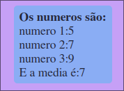
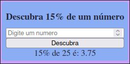
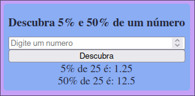
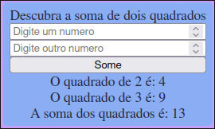
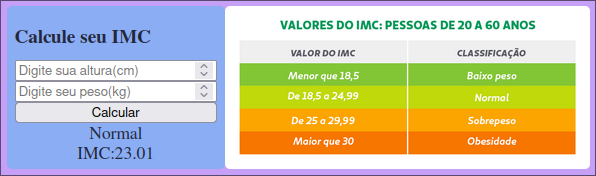
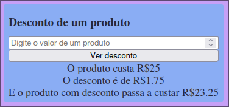

# Material referente a aula 1 de Programação Web III
> Houve uma aula posteriormente explicando o plano curricular da matéria

Na primeira aula a linguagem PHP foi desmonstrada com alguns [exemplos](/aula01/exemplos)
em sequência foram passados alguns [exercicios](/aula01/exercicios/enunciado/ListaDeExercicios.pdf) dos quais podem ser acessados na tabela abaixo

|                Exercicio              |      Imagem demonstração     |
| ------------------------------------- | ---------------------------- |
|[exercicio 1](/aula01/exercicios/1.php)| |
|[exercicio 2](/aula01/exercicios/2.php)| |
|[exercicio 3](/aula01/exercicios/3.php)| |
|[exercicio 4](/aula01/exercicios/4.php)| |
|[exercicio 5](/aula01/exercicios/5.php)| |
|[exercicio 6](/aula01/exercicios/6.php)| |

