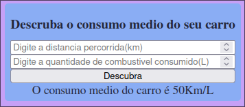

# Material referente a aula 2 de Programação Web III

Na segunda aula foram passados alguns [exercicios](/aula02/exercicios/enunciado/ListaDeExercicios.pdf), continuação da aula 1 dos quais podem ser acessados na tabela abaixo

|                Exercicio              |      Imagem demonstração     |
| ------------------------------------- | ---------------------------- |
|[exercicio 1](/aula02/exercicios/1.php)| |
|[exercicio 2](/aula02/exercicios/2.php)| |
|[exercicio 3](/aula02/exercicios/3.php)| |
|[exercicio 4](/aula02/exercicios/4.php)| |

